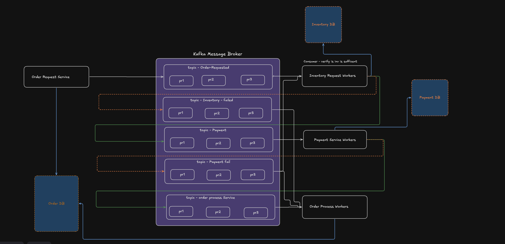

# Order Saga Event System

A distributed, event-driven order processing backend built around the **choreography saga pattern**, designed to handle **10,000+ order requests/sec**. Order, Inventory, Payment, and Analytics are independent services, each owning its own database, coordinating only through Kafka — no service ever calls another directly, and no central orchestrator exists.

## Why this exists

A single-database, single-transaction order flow doesn't scale past one database's write throughput, and a synchronous call chain (Order → Inventory → Payment) means one slow/down service takes the whole flow with it. This system trades that for eventual consistency and per-service independence: each step commits locally and emits an event: the next service reacts, and a failure anywhere triggers an explicit **compensating transaction** (e.g. releasing reserved stock) instead of a rollback that can't span separate databases.

## High-Level Design



**Happy path:**
```
Order Request Service produces event
  -> [topic: order-requested]
  -> Inventory Request Workers (reserve stock, write Inventory DB)
  -> [topic: payment-requested]
  -> Payment Service Workers (charge, write Payment DB)
  -> [topic: payment-success]
  -> Order Process Workers (mark CONFIRMED, write Order DB)
```

**Inventory failure** (stock insufficient):
```
Inventory Request Workers -> [topic: inventory-failed] -> Order Process Workers
  -> order marked CANCELLED
```

**Payment failure** (charge declined) — one topic, two independent consumers:
```
Payment Service Workers -> [topic: payment-fail] -> fans out to:
  1. Inventory Request Workers -> releases the reserved stock
  2. Order Process Workers -> order marked CANCELLED
```

Every worker touches exactly one database — **database-per-service** is enforced structurally, not just by convention: no worker ever holds a connection to another service's database. Compensation always happens through order-service's *own* consumer reacting to the failure topic, never by a foreign worker reaching into order-db directly.

## Idempotency

Kafka guarantees at-least-once delivery, so every consumer has to tolerate redelivery without double-charging a card or double-decrementing stock.

- `inventory-service` and `payment-service` each have a `ProcessedEvent` table (`event_id` as primary key). Before acting on a message, the handler checks whether that `event_id` was already processed — inside the **same DB transaction** as the actual write, so there's no gap between "checked" and "recorded."
- Every event gets a **new** `event_id` per hop — `order_id` is the constant that threads a saga together, `event_id` is unique per step. Downstream event IDs are derived **deterministically** (`SHA1(source_event_id + step_name)`), not randomly generated. This matters specifically for retries: if a handler's Kafka publish is retried, a random ID would mint a brand-new "new" event each attempt, defeating every downstream idempotency check that dedupes on `event_id`. A deterministic ID reproduces the exact same downstream event every time, so retries are safely no-ops end-to-end, not just at the first hop.
- **Known gap:** `order-service`'s own worker does not have a `ProcessedEvent` check — its `UPDATE status = X` is idempotent only because reapplying the same status twice is harmless by luck, not because it's tracked like the other two services. Worth closing before treating this as production-grade.

## Failure handling: straight to DLQ, no in-place retry

Earlier versions of this system retried a failed message up to 3 times on the same topic before giving up. That's gone — on any handler failure, the message goes **directly** to that topic's `-dlq` counterpart (`<topic>-dlq`). Kafka already redelivers on its own if a consumer crashes before committing an offset; an app-level retry loop on top of that was extra bookkeeping, not extra safety.

Two different kinds of failure inside a handler get different treatment:
- **The DB write itself fails** (e.g. DB unreachable) — outcome is genuinely unknown, so the handler immediately publishes the failure topic (`inventory-failed`/`payment-failed`) so the order doesn't hang forever, *and* the raw message still lands in the DLQ for forensics/manual replay.
- **The DB write succeeds, but the next publish fails** — the real outcome is already safely recorded. The handler does **not** force a failure event here (that could falsely cancel an order that actually succeeded); it lets the message hit the DLQ and relies on the idempotent replay to reproduce the correct outcome.

## Kafka topics

10 topics, partition counts tiered by expected volume, not one-size-fits-all:

| Topic | Local partitions | AWS partitions | Purpose |
|---|---|---|---|
| `order-requested` | 2 | 10 | Order created |
| `payment-requested` | 2 | 10 | Stock reserved, ready to charge |
| `payment-success` | 2 | 10 | Charge succeeded |
| `inventory-failed` | 2 | 3 | Stock insufficient (or a technical failure reserving it) |
| `payment-failed` | 2 | 3 | Charge declined (or a technical failure charging) |
| `order-requested-dlq` | 3 | 2 | Dead letters |
| `payment-requested-dlq` | 3 | 2 | Dead letters |
| `inventory-failed-dlq` | 3 | 2 | Dead letters |
| `payment-success-dlq` | 3 | 2 | Dead letters |
| `payment-failed-dlq` | 3 | 2 | Dead letters |

All keyed by `order_id` — every event for one order lands on the same partition, so Kafka's per-partition ordering guarantee actually applies across an order's whole saga, not just within one topic in isolation. AWS partition counts and replication factor 3 (`min.insync.replicas=2`) are set in `k8s/kafka/topics-job.yaml`; local docker-compose stays at replication factor 1 since it's a single broker.

## Tech stack

- **Django** (REST APIs, one per service, sync request/response)
- **Go** (Kafka consumer/producer workers — goroutines suit a high-concurrency, I/O-bound consumer loop)
- **Kafka** (KRaft mode, no ZooKeeper) as the event backbone
- **PostgreSQL** per service, **PgBouncer** in front of order-db (the one instance under direct HTTP load)
- **React** dashboard for browsing the event trail per order, backed directly by analytics-service's API
- **Prometheus + Grafana** for metrics; **KEDA** for Kafka-lag-based autoscaling; **k6 / k6-operator** for load testing
- **Terraform** (EKS, VPC, RDS, ECR) for the AWS deployment

## Repo layout

```
order-service/apis/        Django API (create/view orders)
order-service/workers/     Go worker — marks orders CONFIRMED/CANCELLED
inventory-service/apis/    Django API (products, stock)
inventory-service/workers/ Go worker — reserve/release stock
payment-service/workers/   Go worker — mock payment charge
analytics-service/apis/    Django API (event trail, dead letters)
analytics-service/workers/ Go worker — ingests every topic for the dashboard
dashboard_fe/               React dashboard (search by order_id, view raw event trail)
order_load_test/            k6 load test script
terraform/                  AWS infra: EKS, VPC, RDS, ECR
k8s/                         Kubernetes manifests — one folder per service, plus kafka/, monitoring/, keda/, k6-operator/
monitoring/                  Local Prometheus + Grafana config
```

## Running locally

```bash
docker compose up -d --build
```

| Service | URL |
|---|---|
| Order API | http://localhost:8100 |
| Inventory API | http://localhost:8200 |
| Payment metrics | http://localhost:9103/metrics |
| Analytics API | http://localhost:8400 |
| Dashboard | http://localhost:5173 (run `npm run dev` in `dashboard_fe/`) |
| Kafka UI (kafbat) | http://localhost:8080 |
| Prometheus | http://localhost:9090 |
| Grafana | http://localhost:3000 (`admin`/`admin`) |

Create an order:
```bash
curl -X POST http://localhost:8100/orders/create_order/ \
  -H "Content-Type: application/json" \
  -d '{"customer_id":"<any-uuid>","product_id":"234bf452-a77c-48aa-86f4-bb0b358ba778","qty":1}'
```
Then search the returned `order_id` in the dashboard to see the full event trail.

First-time setup also needs, per Django service: `python manage.py migrate`, and for inventory-service specifically, `python manage.py migrate_products` to seed the 3 demo products with a billion units of stock each (sized for load testing, not a real catalog).

## Deploying to AWS

1. `terraform apply` — provisions EKS (app node group on Spot + a tainted on-demand Kafka node group), VPC, 4 RDS Postgres instances, and 8 ECR repos.
2. Build and push each service's image to its ECR repo (`terraform output ecr_repository_urls`), then update the image references in `k8s/*/api-deployment.yaml` / `worker-deployment.yaml`.
3. `kubectl apply -f k8s/kafka/` — brings up the 3-broker KRaft StatefulSet and creates all 10 topics.
4. `kubectl apply -f k8s/order-service/ k8s/inventory-service/ k8s/payment-service/ k8s/analytics-service/`.
5. Install KEDA (`k8s/keda/README.md`) and apply its `ScaledObject`s — workers scale 2-10 replicas based on real Kafka consumer lag, not CPU.
6. Install k6-operator (`k8s/k6-operator/README.md`) and run the load test **from inside the cluster** — running it from a laptop against a remote AWS endpoint just measures your home network's bandwidth, not the system.
7. `kubectl apply -f k8s/monitoring/` — Prometheus discovers pods dynamically (not static targets), so it keeps working as KEDA changes replica counts.

## Known gaps (being worked through)

- `order-service`'s worker has no `ProcessedEvent` idempotency check (see above).
- k8s manifests still point every service at its own in-cluster Postgres StatefulSet, not the RDS instances Terraform provisions — needs the `POSTGRES_HOST` env vars repointed at `terraform output db_endpoints` before a real AWS run.
- No AWS Load Balancer Controller / Ingress yet — services are reachable via `NodePort` only, and EKS nodes sit in private subnets, so external access currently requires `kubectl port-forward`.
- The 10k/sec target hasn't been executed end-to-end against real AWS infrastructure yet — validated locally at a much smaller scale (local docker-compose's 4 gunicorn workers per API cap out far below the target, by design — that capacity is meant to come from the AWS deployment, not a laptop).
